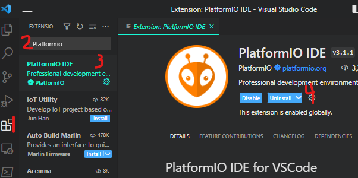
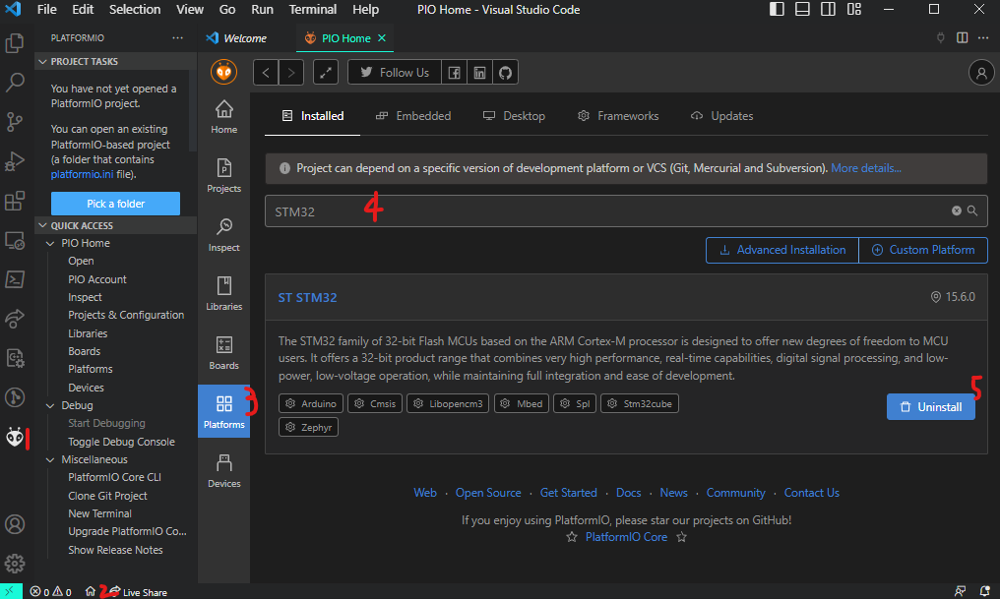

# Hello World

## Objectives

1. Everything Installed & Running as expected
2. LEDs blink
3. General Resource Orientation

## Materials

- STM-Nucleo-F446RE
- USB-A to Mini-USB connector

## Prelab

1. What are the Board Specs
   1. FLASH?
   2. RAM?
   3. Operational Frequency?
2. Why can't I return from `main()`?
3. Should FP values be avoided on this board? Why?
4. What peripheral enables the system clock to other peripherals?
5. In the system’s memory table, are the peripheral registers higher or lower in address than the SRAM?
6. What information does each of the four main datasheets/manuals used in the labs provide?
7. Why do STM32F0 devices not recognize inputs/outputs on a chip by physical pin numbering?
8. What is the name of ST’s header file that defines names for the peripheral registers?
9. What peripheral do the HAL library delay functions use?
10. What bitwise operator would you use to: _(This should be in a quiz, not a prelab)_
    1. set a bit in a register?
    2. clear a bit in a register?
    3. mask a bit in a register?

## Lab - Hello World

1. PlatformIO runs on top of [Visual Studio Code (VS Code for short)](https://code.visualstudio.com), so go to the [VS Code site](https://code.visualstudio.com) to download that first. If running a debian-based OS, I suggest you use the *.deb package as it allows full access to the command line.
2. Install Platformio:
   1. Click on the _(1) extensions icon_ in the left-hand sidebar
   2. Enter **PlatformIO** into the _(2) extensions search bar_
   3. Select _(3) PlatformIO_ from among the results
   4. _(4) Install_ it (mine's installed already, so it says uninstall)
   5. Once installed, VS Code may need to reboot. \

3. Install `STM 32 Platform`
   1. Launch _Platformio IDE_ by selecting the new icon on the left-hand sidebar.
   2. Click on the little _house icon (PlatformIO Home)_ on the left side of the strip at the bottom of the window. This will work as long as PlatformIO has been launched
   3. Select the Platforms tab in the PIO window
   4. Search for STM32
   5. Select Install \
   
4. Open a Example Project
   1. Navigate to PlatformIO Home by clicking on the _house icon_ in the upper icon of the left-hand sidebar in the PlatformIO Home window
   2. Select _Project Examples_
      1. Open `stm32cube-hal-blink` \
      
5. 
