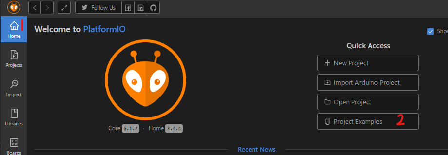
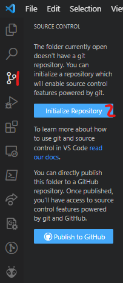

# Hello World

## Objectives

1. Install & use:
   1. VS Code
   2. Platformio
      1. GUI
      2. CLI
   3. Git
      1. GUI
      2. CLI
2. Bare Metal Programming
   1. Program STM32 Board
   2. Change blink speed
3. Software Practices
   1. Write code to be tested
   2. Write unit tests for code
4. Read the reference manuals for basic information

## Materials

- STM-Nucleo-F446RE
- USB-A to Mini-USB connector

## Prelab

1. What are the Board Specs
   1. FLASH?
   2. RAM?
   3. Operational Frequency?
2. Why can't I return from `main()`?
3. Should FP values be avoided on this board? Why, or why not?
4. What peripheral enables the system clock to other peripherals?
   1. Why aren't all peripherals enabled by default?
5. In the system’s memory table, are the peripheral registers higher or lower in address than the SRAM?
6. What information does each of the four main datasheets/manuals used in the labs provide?
7. Why don't devices recognize inputs/outputs on a chip by physical pin numbering?
8. What is the name of ST’s header file that defines names for the peripheral registers?
9. What peripheral do the HAL library delay functions use?
10. What bitwise operator would you use to: _(This should be in a quiz, not a prelab)_
    1. set a bit in a register?
    2. clear a bit in a register?
    3. mask a bit in a register?

## Lab - Hello World

### Installation

1. PlatformIO runs on top of [Visual Studio Code (VS Code for short)](https://code.visualstudio.com), so go to the [VS Code site](https://code.visualstudio.com) to download that first. If running a debian-based OS, I suggest you use the *.deb package as it allows full access to the command line
2. Follow the [git installation instructions](https://git-scm.com/book/en/v2/Getting-Started-Installing-Git) to install Git
3. Install Platformio: \
   _"One IDE to rule them all; one IDE to find them._ \
   _One IDE to bring them all, and in the Dark Mode, bind them."_
   1. Click on the _(1) extensions icon_ in the left-hand sidebar
   2. Enter **PlatformIO** into the _(2) extensions search bar_
   3. Select _(3) PlatformIO_ from among the results
   4. _(4) Install_ it (mine's installed already, so it says uninstall)
   5. Once installed, VS Code may need to reboot. \

4. Install `STM 32 Platform`
   1. Launch _Platformio IDE_ by selecting the new icon on the left-hand sidebar
   2. Click on the little _house icon (PlatformIO Home)_ on the left side of the strip at the bottom of the window _(This will work as long as PlatformIO has been launched)_
   3. Select the Platforms tab in the PIO window
   4. Search for STM32
   5. Select Install \
   
5. Open Example Project
   1. Navigate to PlatformIO Home by clicking on the _house icon_ in the upper icon of the left-hand sidebar in the PlatformIO Home window
   2. Select _Project Examples_
      1. Open `stm32cube-hal-blink` \
      
6. Open a new PlatformIO Project:
   1. Create a new VS Code window (Leave the Example Project open; we'll be using that)
      1. Select, File $\rightarrow$ New Window (Ctrl + Shft + N)
   2. Open the Platformio Home Page again:
      1. Launch Platformio by clicking on the icon on the left-hand sidebar
      2. Open the PlatformIO home page by clicking on the house button on the left side of the banner at the bottom of the window.
   3. Select "+ New Project" under the **Quick Access** section (above the Project Examples option) and enter the following information into the **Project Wizard:**
      1. Name: \<UID\>-hello-world (grades will be assigned based on the UID)
      2. Board: The Board number
      3. Framework: STM32 Cube (You will fail if you use the Arduino Framework)

_For additional linting help in the c code, install **Miscosoft C/C++** extension and follow one of the tutorials under **C/C++ extension tutorials per compiler and platform** (I used [GCC and Mingw-w64 on Windows](https://code.visualstudio.com/docs/cpp/config-mingw))_

### Platformio IDE

1. Copy the `main.c` file from the example project to your new project (`\<UID\>-hello-world`)
   1. Copy the `main.c` file from HAL-Blink (the example project)
      1. Open the Explorer Tab on the left-hand sidebar to explore the Example Project's files
      2. select `src/main.c`
      3. Copy the file contents
   2. Paste the file into (`\<UID\>-hello-world/src/main.c`)
2. Include only the necessary HAL file
   1. Remove the `#if/elif F*` lines at the beginning of the file
   2. Choose the `STM32**xx_hal.h` that corresponds to the board number (I'm using the Nucleo-F446RE, so I'm keeping only the STM32F4xx_hal.h file); remove the others
3. Compile & upload the code to the board
   1. Connect the board to the computer
   2. Click the check mark on the right side of the banner towards the top of the window \
   _(The carat allows the additional options of: `build`, `test`,`upload`, and `clean`)_
   3. You'll notice a terminal appear. If you do not see [SUCCESS], then there is a problem with your implementation
   4. Scroll to the top of the terminal output; you'll see a command as follows; it's important: \
   `<prompt> > <path>/platformio.exe run --target upload`
4. Add platformio path (`<path>` from the previous prompt [`<prompt> > <path>/platformio.exe run --target upload`]) to system path
    1. [Windows - Add to path](https://www.architectryan.com/2018/03/17/add-to-the-path-on-windows-10/)
    2. [Linux - Add to path](https://linuxize.com/post/how-to-add-directory-to-path-in-linux/)
    3. [Mac - Add to path](https://osxdaily.com/2014/08/14/add-new-path-to-path-command-line/)
5. Open the terminal at the root of the project and explore PlatformIO's CLI (Command-Line Interface):
    1. Upload the compiled output of your code from the command line: \
      `platformio run --target upload`
    2. Explore the help information with the `-h` option (i.e. `platformio -h`)

### Git

_If you want to learn more about git, follow their [git tutorial](https://git-scm.com/docs/gittutorial)_

1. Create a git repo:
    1. Click on the git icon on the left-hand sidebar of VS Code
    2. Click on Initialize Repository \
    
2. Commit the changes thus far:
    1. Stage all current changes (there's a '+' sign by Changes)
    2. Add a commit message
    3. Commit the changes
    4. A "Publish Branch" button replaces the Commit button; click on that and publish it to:
    `...`
3. Create a branch `unit-tests`
4. Add files from this repo
   1. Copy the file `hello-tests.c` from this repo to the directory `<prj>/test`
   2. Copy the file `functions-to-test.c` from this repo to the directory `<prj>/include`
5. Commit the changes on the CLI
   1. Open the terminal in the project directory
   2. Add `<prj>/test/hello-tests.c` to the staged changes \
   `git add <prj>/test/hello-tests.c`
   3. Check the git status \
   `git status` \
   _You should only see the staged change `<prj>/test/hello-tests.c`
   4. Commit the change \
   `git commit`

Another _very important_ tutorial (though there might be better ones out there), this one's about [git commit messages](https://medium.com/@steveamaza/how-to-write-a-proper-git-commit-message-e028865e5791) (yes, bad commit messages exist)

### Bit Manipulation

1. Complete the functions called by the following unit tests:
    1. `void testSetBit()`
       1. `Err setBit(uint32_t* bits, uint8_t n)` $range_{bitNum} = [0,31]$
    2. `void testClearBit()`
       1. `Err setBit(uint32_t* bits, uint8_t n)` $range_{bitNum} = [0,31]$
    3. `void testMaskBit()`
       1. `Err maskBit(uint8_t* masked_bit, uint32_t data, uint8_t n)`

_Make sure to commit after each test passes!_

### Unit Testing

Unit testing is fundamental to software development, and will be one of your most useful tools when verifying that your code works; it's also how you'll be graded--in short, this is a big deal.

1. Install the **Native** platform to facilitate unit testing on your machine
   1. Open Platforms (Platformio Home $\rightarrow$ Platforms $\rightarrow$ Desktop)
   2. Click on the **Desktop** tab
   3. Search _"Native"_
2. Set up a testing environment
   1. Open `platformio.ini`
   2. Add the following code to create a native testing environment \

   ```ini
   [env:unit-test]
   platform = native
   ```

3. Run the unit tests
   1. In the terminal, enter `platformio test -e unit-test`
4. Read the function descriptions found in `functions-to-test.c` and write unit tests verifying each one works as described _(Hint: one should fail)_

_Make sure to commit after completing each test!_

### Turn it in

1. Publish the branch to the remote repository, then make a pull request
2. Merge the pull request. Your UID in the repo will be used to test and grade your submissions
3. You can verify your grade in the lab based on the tests passed and failed
   1. _Add instructions to see the test results_
